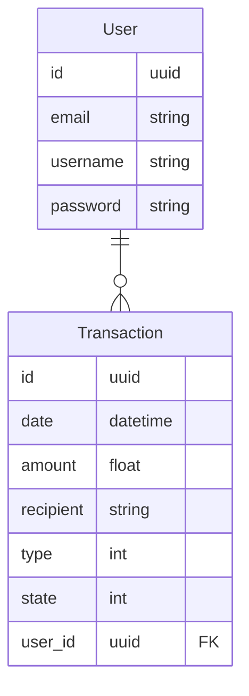

# Peach Tree Bank
This is a task for Senior Python Developer interview for Green Street

# Running the project
In order to run the project you need to have Docker and Docker-compose installed.
After installing the necessary software create a `.env` file in the root of the project
containing the following variables:

* POSTGRES_USER=your-postgres-user
* POSTGRES_PASSWORD=your-secret-password
* POSTGRES_DB=peach_tree_bank

To start the services run `docker compose up` in the root folder of the project.
The app should be accessible on `localhost` from your browser.
Navigate to the login page on `localhost/login`.
Default username is `admin` and password -> `admin`;

# Database ERD

